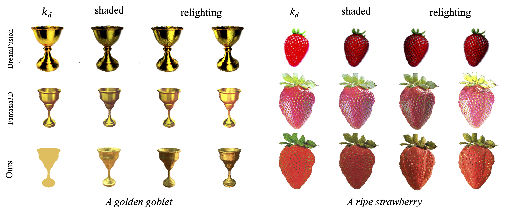

# MATLABER

Offical implementation of the paper *[MATLABER: Material-Aware Text-to-3D via LAtent BRDF auto-EncodeR](https://arxiv.org/abs/2308.09278)*.

Code will be released soon.


<p align="center">
    
</p>

<figure class="fourth">
    
    
    
    
</figure>

## BibTeX

```bibtex
@article{xu2023matlaber,
    title={MATLABER: Material-Aware Text-to-3D via LAtent BRDF auto-EncodeR},
    author={Xu, Xudong and Lyu, Zhaoyang and Pan, Xingang and Dai, Bo},
    journal={arXiv preprint arXiv:2308.09278},
    year={2023}
}
```
